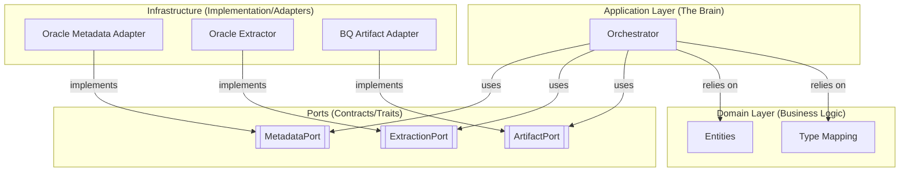
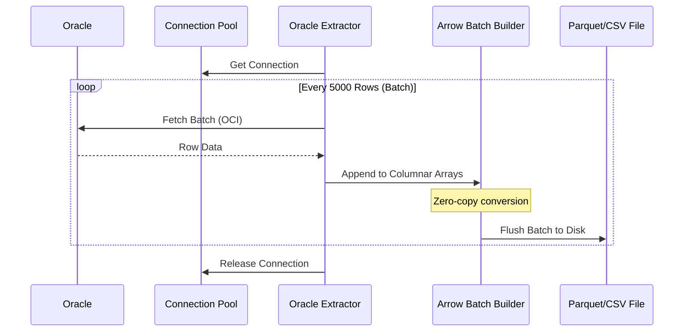
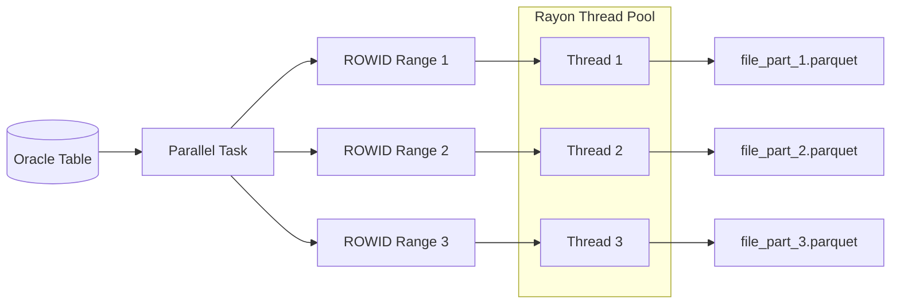

# 🏗️ Architecture & Technical Reference

This document serves as the master reference for the **Oracle Data Exporter for BigQuery**. It covers the architectural patterns, data strategies, and operational constraints of the system, designed to provide both high-level context and educational depth for new developers.

---

## 🏛️ Hexagonal Architecture (Ports and Adapters)

The application follows **Hexagonal Architecture**, which strictly decouples business logic from external I/O. This ensures the core is testable and adapters (Oracle, Filesystem) can be replaced with minimal impact.

### 1. Domain Layer (`src/domain/`)
*   **Role**: Internal state and pure logic. It represents the "Nouns" and "Rules" of the application.
*   **Key Files**:
    *   [`entities.rs`](src/domain/entities.rs): **The Nouns**. Definitions for `TableMetadata`, `ExportTask`, and `TaskResult`.
    *   [`mapping.rs`](src/domain/mapping.rs): **The Bridge**. Logic for converting Oracle types to Arrow/BigQuery types.
    *   [`errors.rs`](src/domain/errors.rs): Centralized error handling using `thiserror`.

### 2. Application Layer (`src/application/`)
*   **Role**: Orchestration and coordination.
*   **Key Files**:
    *   [`orchestrator.rs`](src/application/orchestrator.rs): **The Conductor**. Discovers tables, manages parallelism, and coordinates tasks using Ports.

### 3. Ports (`src/ports/`)
*   **Role**: **Contracts**. They define *what* needs to be done using Rust Traits.
*   [`metadata_port.rs`](src/ports/metadata_port.rs): Contract for schema discovery.
*   [`extraction_port.rs`](src/ports/extraction_port.rs): Contract for data movement.
*   [`artifact_port.rs`](src/ports/artifact_port.rs): Contract for generating sidecar files.

### 4. Infrastructure Layer (`src/infrastructure/`)
*   **Role**: **Adapters**. Technical implementations of the Ports.
*   [`metadata.rs`](src/infrastructure/oracle/metadata.rs): Talks to Oracle's system catalog.
*   [`extractor.rs`](src/infrastructure/oracle/extractor.rs): Streams data directly to disk.
*   [`artifact_adapter.rs`](src/infrastructure/artifacts/artifact_adapter.rs): Generates BQ load scripts.

---

## ⚡ Performance & Data Flow

### 1. Streaming Data Flow
The exporter uses a "Pull-based" streaming model to maintain a constant memory footprint, regardless of table size.

### 2. Parallel Chunking (ROWID)
For very large tables, we don't just run one query. We use Oracle's `DBMS_PARALLEL_EXECUTE` to split the table into physical "chunks" based on block ranges.

---

## 🎓 Rust Patterns for Juniors

Throughout the codebase, we utilize specific Rust features to ensure performance and safety:

- **`Arc<T>` (Atomic Reference Counting)**: Used to share the Database Connection Pool or specific Adapters across many worker threads safely.
- **`Box<dyn Trait>` (Dynamic Dispatch)**: Used to swap between CSV and Parquet writers at runtime without the Orchestrator needing to know the details.
- **`Send + Sync`**: These are "Marker Traits". We add them to our Ports to guarantee to the compiler that our objects are safe to be used in parallel across threads.
- **Zero-Copy Macros**: We use macros like `impl_push!` in the extractor to rapidly move data from Oracle's memory buffers into Arrow's memory buffers without extra allocations.

---

## 📈 Benchmarks

| Format | Throughput (MB/s) | Throughput (Rows/s) | Notes |
| :--- | :--- | :--- | :--- |
| **CSV (Gzip)** | **18.8 MB/s** | **63,000** | Faster rows/s due to simpler formatting |
| **Parquet** | **17.0 MB/s** | **26,000** | Slower rows/s but results in binary files |

---

## 🔍 Specialized Logic

- **Virtual Columns**: Implemented as **BigQuery Views** using DATA_DEFAULT logic.
- **Intervals**: Custom SQL transformations ensure Oracle `INTERVAL` types match BigQuery's expected string literal format.
- **Oracle NUMBER**: Mapped dynamically based on precision/scale (mapped in `mapping.rs`).

---

## 🛠️ Maintainer Notes

*   **Adding a Type**: Update `map_oracle_to_arrow` in [`mapping.rs`](src/domain/mapping.rs).
*   **Integration Testing**: Run [`tests/scripts/run_all.sh`](tests/scripts/run_all.sh).
